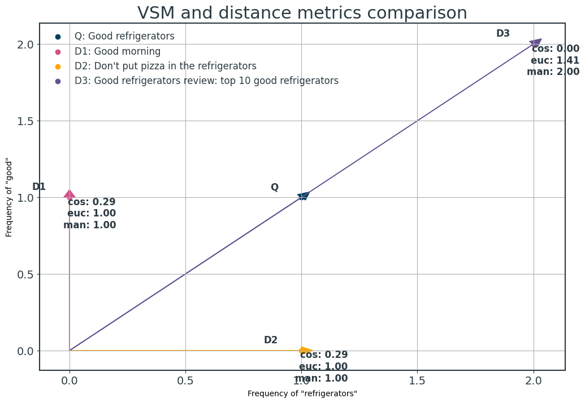
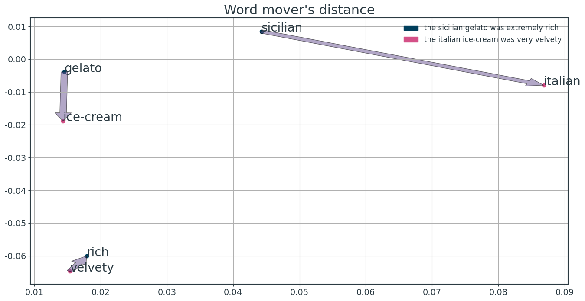
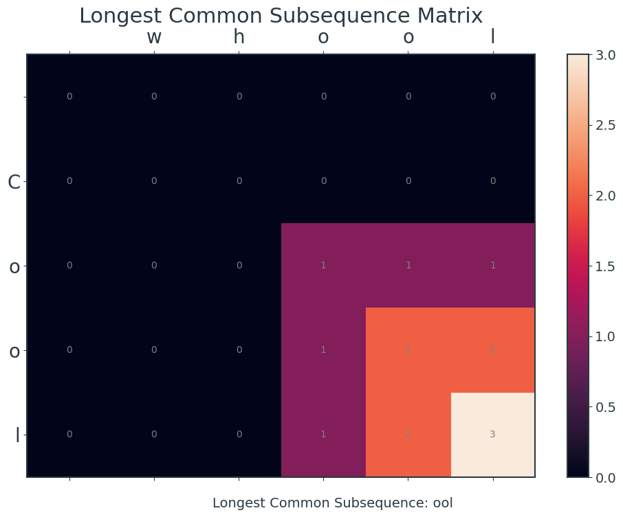
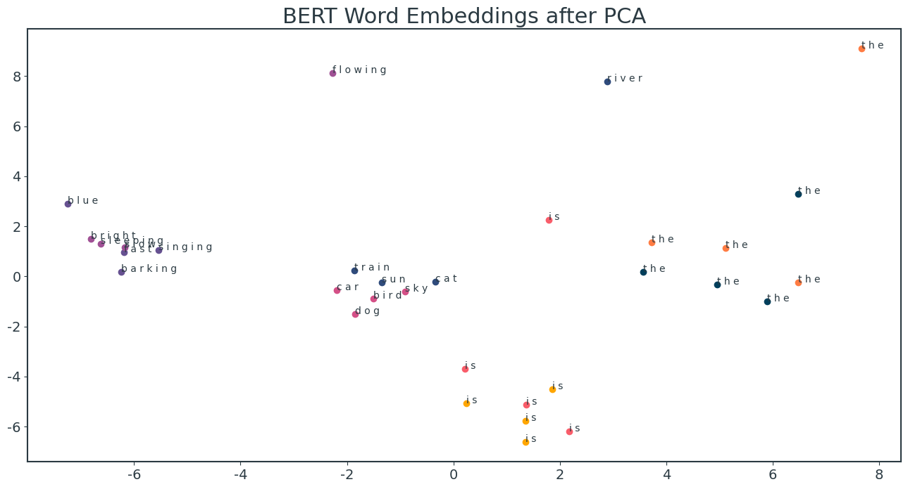

# A comparison of text distance algorithms

    [nltk_data] Downloading package punkt to
    [nltk_data]     /Users/micheledinelli/nltk_data...
    [nltk_data]   Package punkt is already up-to-date!
    [nltk_data] Downloading package stopwords to
    [nltk_data]     /Users/micheledinelli/nltk_data...
    [nltk_data]   Package stopwords is already up-to-date!
    [nltk_data] Downloading package punkt to
    [nltk_data]     /Users/micheledinelli/nltk_data...
    [nltk_data]   Package punkt is already up-to-date!

# Text distance: outline

- [Length distance](#length-distance)
  - Euclidean distance
  - Cosine distance
  - Manhattan distance
  - Hamming distance
- [Distribution distance](#distribution-distance)
  - JS divergence
  - KL divergence
  - Wasserstein distance
- [Semantic distance](#semantic-distance)
  - Word mover's distance
  - Word mover's distance extension

### Length Distance 

#### Algorithms

    

    

Insight on euclidean vs cosine similarity

<table border="1" class="dataframe">
  <thead>
    <tr style="text-align: right;">
      <th></th>
      <th>good</th>
      <th>refrigerators</th>
    </tr>
  </thead>
  <tbody>
    <tr>
      <th>Q</th>
      <td>1</td>
      <td>1</td>
    </tr>
    <tr>
      <th>D1</th>
      <td>1</td>
      <td>0</td>
    </tr>
    <tr>
      <th>D2</th>
      <td>0</td>
      <td>1</td>
    </tr>
    <tr>
      <th>D3</th>
      <td>2</td>
      <td>2</td>
    </tr>
  </tbody>
</table>

    

    

### Distribution distance

#### Algorithms

    KL divergence between documents: 0.303
    JS divergence between documents: 0.077
    Wasserstein distance between documents: 0.035

    

    

### Semantic distance

    

    

    

    

    Length of Longest Common Subsequence: 3
    Longest Common Subsequence: ool

    

    

# A comparison of text representation methods

# Text representation: outline

- [String based](#string-based)
  - Character based
    - LCS distance
    - Edit distance
    - Jaro similarity
  - Phrase based
    - Dice
    - Jaccard 
- [Corpus based](#corpus-based)
  - Bag of word model
    - BOW
    - TF-IDF 
  - Shallow window based
    - Word2Vec
    - GloVe
    - BERT
- [Matrix factorization methods](#matrix-factorization)
  - LSA
  - LDA
- [Graph structure](#graph-based)
  - Knowledge graph
  - Graph neural network

## String Based

### Algorithms

    Levenshtein distance between The sky is blue and The sun is bright: 7.00
    Longest common substring distance between The sky is blue and The sun is bright: 5.00
    Jaro similarity between The sky is blue and The sun is bright: 0.75

    Levenshtein distance between The sky is blue and The sky is blue: 0.00
    Longest common substring distance between The sky is blue and The sky is blue: 15.00
    Jaro similarity between The sky is blue and The sky is blue: 1.00

<table border="1" class="dataframe">
  <thead>
    <tr style="text-align: right;">
      <th></th>
      <th>customer_id</th>
      <th>birth</th>
      <th>city</th>
    </tr>
  </thead>
  <tbody>
    <tr>
      <th>0</th>
      <td>109238</td>
      <td>07-12-87</td>
      <td>Rome</td>
    </tr>
    <tr>
      <th>1</th>
      <td>1132125</td>
      <td>23-08-89</td>
      <td>London</td>
    </tr>
    <tr>
      <th>2</th>
      <td>159483</td>
      <td>28-11-90</td>
      <td>Paris</td>
    </tr>
    <tr>
      <th>3</th>
      <td>198828</td>
      <td>22-12-92</td>
      <td>Bristol</td>
    </tr>
  </tbody>
</table>

<table border="1" class="dataframe">
  <thead>
    <tr style="text-align: right;">
      <th></th>
      <th>order_numb</th>
      <th>cust_numb</th>
      <th>cost</th>
      <th>city</th>
    </tr>
  </thead>
  <tbody>
    <tr>
      <th>0</th>
      <td>121212</td>
      <td>109238</td>
      <td>100</td>
      <td>Rome</td>
    </tr>
    <tr>
      <th>1</th>
      <td>151892</td>
      <td>1132125</td>
      <td>200</td>
      <td>London</td>
    </tr>
    <tr>
      <th>2</th>
      <td>312526</td>
      <td>159483</td>
      <td>300</td>
      <td>Paris</td>
    </tr>
    <tr>
      <th>3</th>
      <td>418825</td>
      <td>19882</td>
      <td>400</td>
      <td>Bristol</td>
    </tr>
  </tbody>
</table>

    

    

    Dice coefficient between The sky is blue and The sun is bright: 0.70
    Jaccard similarity between The sky is blue and The sun is bright: 0.53

## Corpus Based

    

    

## Shallow Window based

    

    

    

    

    Some weights of the model checkpoint at bert-base-uncased were not used when initializing BertModel: ['cls.predictions.transform.dense.bias', 'cls.predictions.transform.LayerNorm.weight', 'cls.predictions.transform.dense.weight', 'cls.predictions.bias', 'cls.seq_relationship.bias', 'cls.predictions.transform.LayerNorm.bias', 'cls.seq_relationship.weight']
    - This IS expected if you are initializing BertModel from the checkpoint of a model trained on another task or with another architecture (e.g. initializing a BertForSequenceClassification model from a BertForPreTraining model).
    - This IS NOT expected if you are initializing BertModel from the checkpoint of a model that you expect to be exactly identical (initializing a BertForSequenceClassification model from a BertForSequenceClassification model).

    

    

## Matrix factorization

    Topic 1: space, like, don, know, year
    Topic 2: thanks, graphics, files, image, space
    Topic 3: space, nasa, launch, shuttle, orbit
    Topic 4: graphics, just, don, think, like
    Topic 5: file, image, cview, files, tiff

## Semantic text matching

## Graph based

    

    

