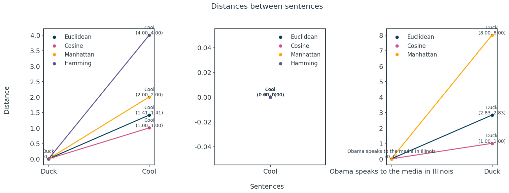
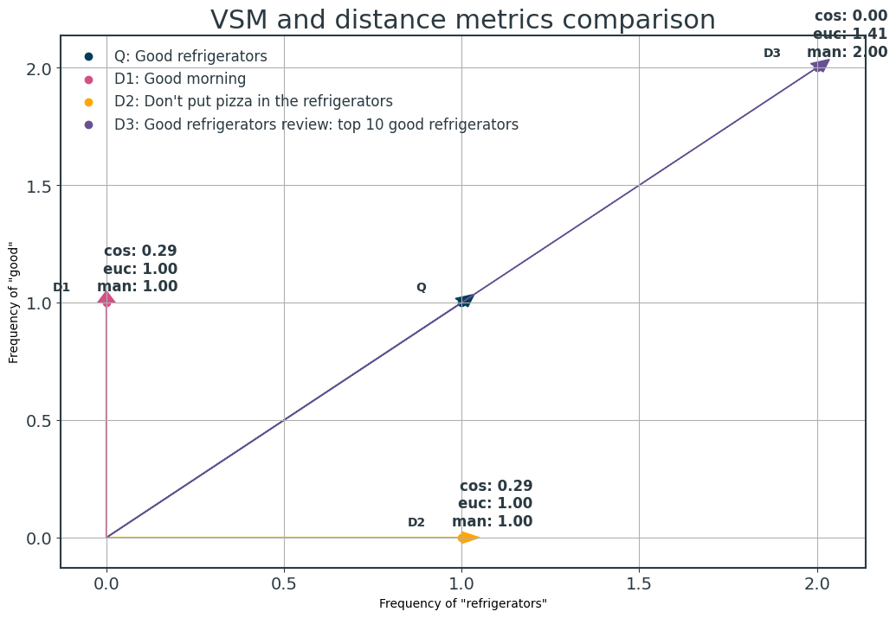
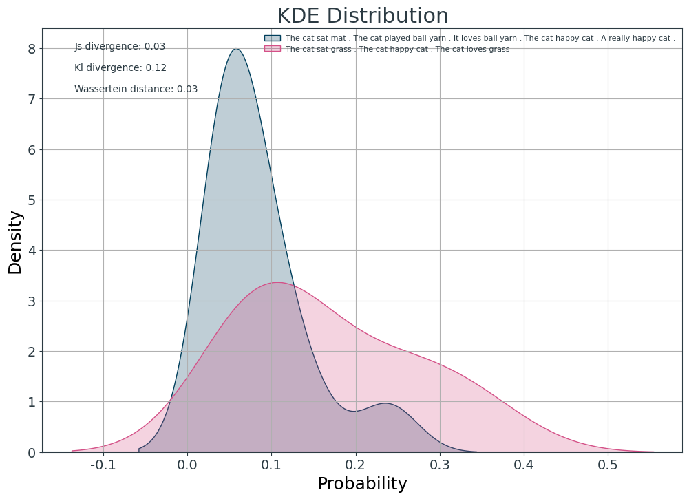
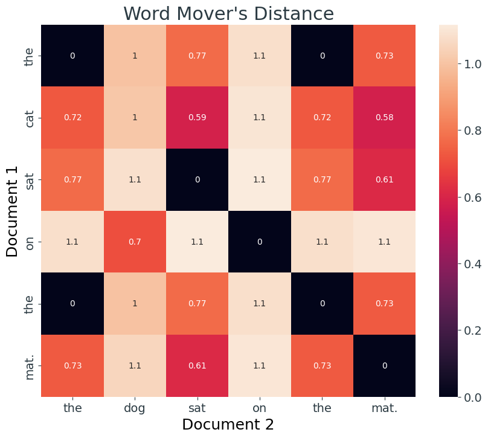
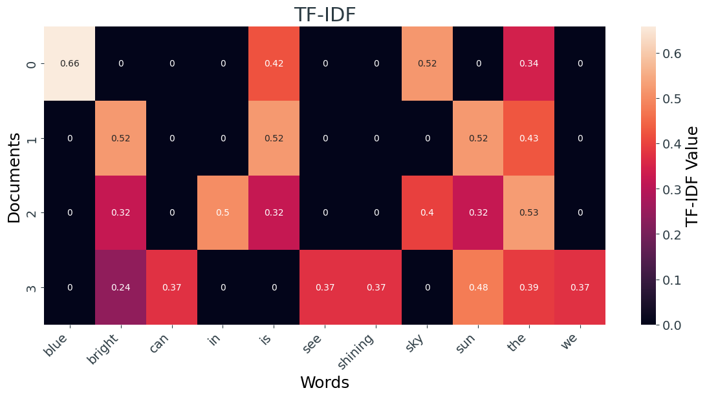
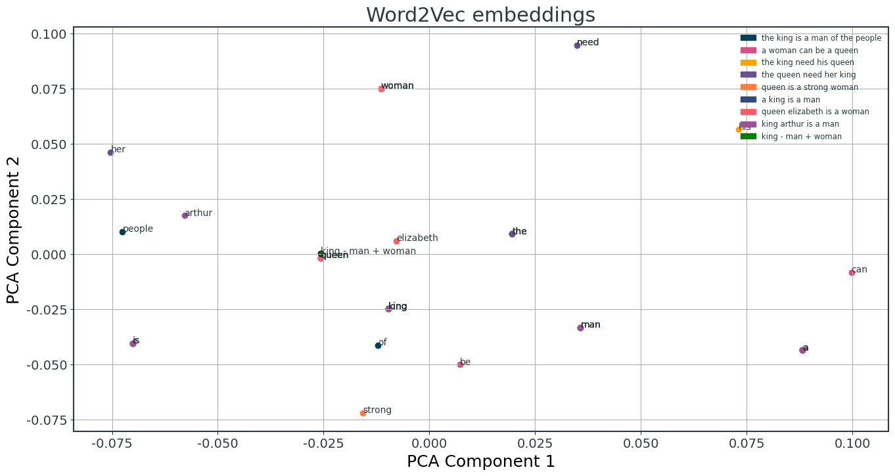
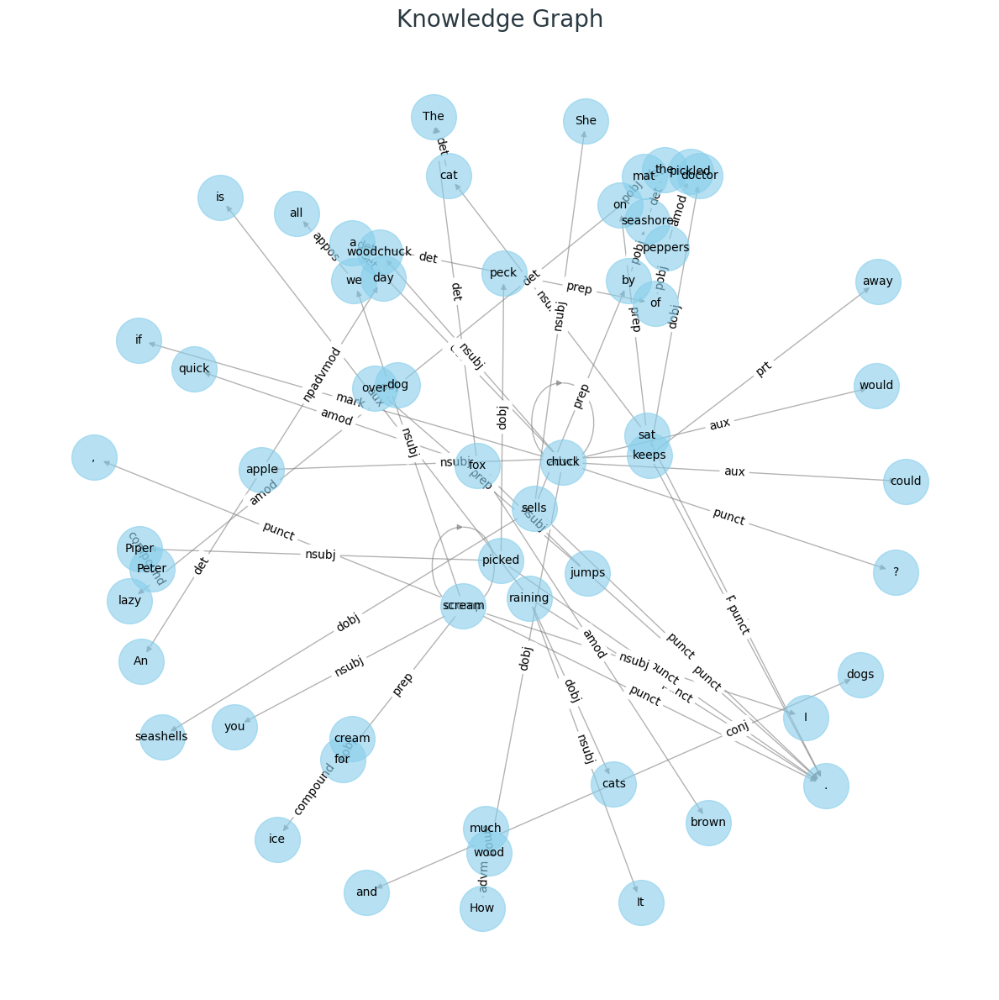

# A comparison of text distance algorithms

# Text distance: outline

- [Length distance](#length-distance)
  - Euclidean distance
  - Cosine distance
  - Manhattan distance
  - Hamming distance
- [Distribution distance](#distribution-distance)
  - JS divergence
  - KL divergence
  - Wasserstein distance
- [Semantic distance](#semantic-distance)
  - Word mover's distance
  - Word mover's distance extension

### Length Distance 

#### Algorithms

    

    

    

    

### Distribution distance

#### Algorithms

    

    

### Semantic distance

    

    

    

    

    Length of Longest Common Subsequence: 3
    Longest Common Subsequence: ool

    

    

# A comparison of text representation methods

# Text representation: outline

- [String based](#string-based)
  - Character based
    - LCS distance
    - Edit distance
    - Jaro similarity
  - Phrase based
    - Dice
    - Jaccard 
- [Corpus based](#corpus-based)
  - Bag of word model
    - BOW
    - TF-IDF 
  - Shallow window based
    - Word2Vec
    - GloVe
    - BERT
- [Matrix factorization methods](#matrix-factorization)
  - LSA
  - LDA
- [Graph structure](#graph-based)
  - Knowledge graph
  - Graph neural network

## String Based

### Algorithms

    

    

## Corpus Based

    

    

## Shallow Window based

    

    

    

    

## Matrix factorization

## Semantic text matching

## Graph based

    

    

    Top terms per component:
    Topic 1: don, space, people, god, com
    Topic 2: morality, sgi, livesey, caltech, keith
    Topic 3: newton, apple, god, kent, sandvik
    Topic 4: toronto, apple, henry, kent, sandvik
    Topic 5: spencer, zoo, god, toronto, henry
    Topic 6: spencer, zoo, graphics, toronto, henry
    Topic 7: com, pat, alaska, digex, access
    Topic 8: values, frank, alaska, morality, objective
    Topic 9: digex, objective, livesey, access, sgi
    Topic 10: jaeger, alaska, islam, livesey, sgi

